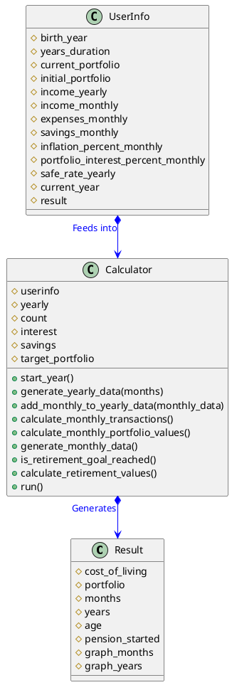

# Class Diagrams

```plantuml
@startuml

class Result {
    # cost_of_living
    # portfolio
    # months
    # years
    # age
    # pension_started
    # graph_months
    # graph_years
}

class UserInfo {
    # birth_year
    # years_duration
    # current_portfolio
    # initial_portfolio
    # income_yearly
    # income_monthly
    # expenses_monthly
    # savings_monthly
    # inflation_percent_monthly
    # portfolio_interest_percent_monthly
    # safe_rate_yearly
    # current_year
    # result
}

class Calculator {
    # userinfo
    # yearly
    # count
    # interest
    # savings
    # target_portfolio
    + start_year()
    + generate_yearly_data(months)
    + add_monthly_to_yearly_data(monthly_data)
    + calculate_monthly_transactions()
    + calculate_monthly_portfolio_values()
    + generate_monthly_data()
    + is_retirement_goal_reached()
    + calculate_retirement_values()
    + run()
}

note left of Result::stuff
    Example note
endnote

UserInfo "Feeds into" *--> Calculator #line:blue;text:blue
Calculator "Generates" *--> Result #line:blue;text:blue


@enduml
```
